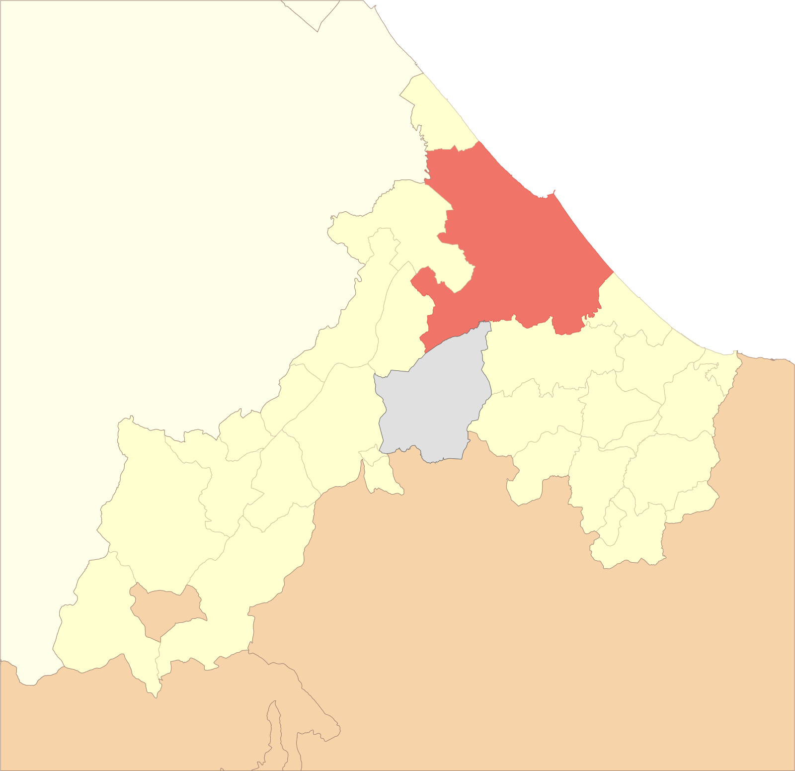

# SVG Maps Italy
[](https://www.ruby-lang.org/)
[](https://github.com/rubocop-hq/rubocop)
[](https://github.com/pre-commit/pre-commit)


Ruby scripts used to create SVG maps of Italian _comuni_ and provinces from OSM data.

## Installation

To manually build the gem, run the following script:

    $ ./build_gem.sh

To install it in your system, execute:

    $ gem install svg_maps_italy-<version>.gem

## Description
I made these scripts to create SVG maps of Italian administrative subdivisions (namely regions, provinces and _comuni_),
intending to publish them on Wikipedia, like I did
[several years ago](https://commons.wikimedia.org/wiki/File:Map_of_comune_of_Rimini_(province_of_Rimini,_region_Emilia-Romagna,_Italy).svg).

This time I chose a more complete and visually pleasant appearance (with the option to furtherly customize them via CSS
stylesheet), showing the nearby provinces, regions and nations. Moreover, when hovering above a subdivision on the map,
its name will be shown in a tooltip and its boundaries will be highlighted (though this feature can be turned off
modifying the CSS).

This is how a map of a _comune_ will look like with the default style (in this case Rimini, province of Rimini, region
Emilia-Romagna):



The _comune_ of interest is shown in red, whereas the other _comuni_ of the province are in yellow. A lighter shade of
yellow is for the other provinces of the same region, whereas the neighboring regions are in orange. Finally, the 
independent nation of San Marino is colored in gray.

_Note_: if you don't see the tooltips and the highlighted boundaries, try to right click on the image and select _Show
image_.

## Usage

### Prerequisites

These scripts use [Mapshaper](mbloch/mapshaper) to perform all the magics on the map data. If it isn't installed
nothing will work...

#### Source datasets
All the map data are from OpenStreetMaps ([copyright notice](https://www.openstreetmap.org/copyright)). The source
datasets consist in a file for each of the 20 Italian regions and one for each of the countries that share a border
with Italy (France, Switzerland, Austria, Slovenia, San Marino and Vatican City). You have to download them on your
local drive and perform some operations (maybe one day I will implement a way to automate it...). The default 
dataset location is in the subdirectory `data` of the working directory, but can be changed via command line option.

##### Italian regions
Create the subdirectory `regions` in the dataset directory, then go to http://overpass-turbo.eu/ and enter the
following query:

```
[out:json][timeout:25];
area["ISO3166-2"="IT-xx"]->.searchArea;
(
  node["boundary"="administrative"]["admin_level"="4"](area.searchArea);
  node["boundary"="administrative"]["admin_level"="6"](area.searchArea);
  node["boundary"="administrative"]["admin_level"="8"](area.searchArea);
  relation["boundary"="administrative"]["admin_level"="4"](area.searchArea);
  relation["boundary"="administrative"]["admin_level"="6"](area.searchArea);
  relation["boundary"="administrative"]["admin_level"="8"](area.searchArea);
);
out body;
>;
out skel qt;
```

replacing the string `IT-xx` with the ISO 3166-2:IT code for the corresponding region (you can find it 
[here](https://it.wikipedia.org/wiki/ISO_3166-2:IT#Regioni)). Execute it and download the result as GeoJson.

Save the file into the `regions` directory with the extension `.geojson`, whereas the name is the one
of the region in lowercase (e.g. `friuli-venezia giulia.geojson` for Friuli-Venezia Giulia). The only
exception is Valle d'Aosta (due to the apostrophe), whose file name should be `valle aosta.geojson`.
If you prefer you can always change the names by editing the file [region.rb](lib/svg_maps_italy/region.rb).

##### Foreign states
Using the previous method for the foreign states is difficult because the data would show the maritime
boundaries instead of the coastline. A simpler approach is shown below.

First, create the subdirectory `states` in the dataset directory, then go to 
[this site](https://osm-boundaries.com/Map) (you must authenticate with an OpenStreetMap account).
For each of the following nations:
- France
- Switzerland
- Austria
- Slovenia
- San Marino
- Vatican City

select the corresponding item in the list (for France, use the sub-item _Metropolitan France_) and 
click _Download_.

In the dialog that opens, set the options as below:
- Based on _Selection_
- Admin level min: _2_, max: _2_ (both _3_ for France).
- _Land only_
- All tags _Exclude_
- Simplify _No_

then click _Download_.

Extract the GeoJSON file from the archive, then run the following command, in order to make the 
dataset coherent with the previous ones:
```bash
mapshaper -i file.geojson -each 'admin_level=admin_level.toString();id=id.toString()' -rename-fields @id=id -o out.geojson
```

Finally, rename the file `out.geojson` into the nation name in lowercase (e.g. `san marino.geojson`
for San Marino) and move it to the subdirectory `states`. You can change the file names by editing
the file [state.rb](lib/svg_maps_italy/state.rb). 

## Contributing

Bug reports and pull requests are welcome on GitHub at https://github.com/vonvikken/svg-maps. This project is
intended to be a safe, welcoming space for collaboration, and contributors are expected to adhere to the
[code of conduct](https://github.com/vonvikken/svg-maps/blob/master/CODE_OF_CONDUCT.md).


## Code of Conduct

Everyone interacting in the SvgMapsItaly project's codebases, issue trackers, chat rooms and mailing lists is expected
to follow the [code of conduct](https://github.com/vonvikken/svg-maps/blob/master/CODE_OF_CONDUCT.md).
